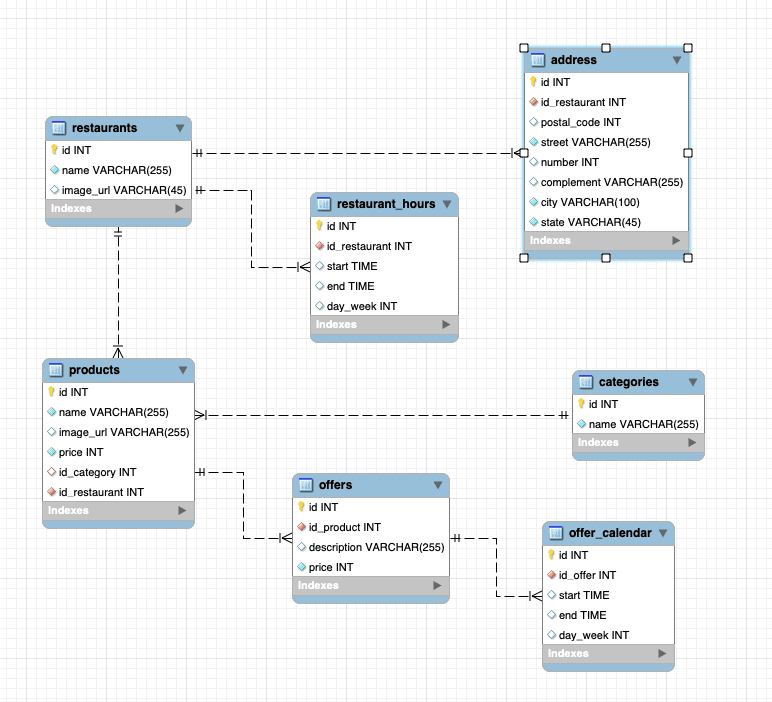

# Goomer Lista Rango 🥐 🍕 🍔

## Sumário

- [Goomer Lista Rango](#goomer-lista-rango)
  - [Sumário](#sumário)
  - [Sobre este projeto](#sobre-este-projeto)
    - [O que foi desenvolvido](#o-que-foi-desenvolvido)
    - [Tecnologias utilizadas](#tecnologias-utilizadas)
    - [Banco de dados](#banco-de-dados)
  - [Execução da aplicação](#execução-da-aplicação)
    - [Pré-requisitos](#pré-requisitos)
    - [Variáveis de ambiente](#variáveis-de-ambiente)
    - [Instalação das dependências e execução](#instalação-das-dependências-e-execução)
  - [Desafios](#desafios)
  - [Melhorias](#melhorias)
  - [Autoria](#autoria)

## Sobre este projeto

O projeto se trata de uma API utilizando Node.js com Express, utilizando um banco de dados relacional MySQL.

### O que foi desenvolvido

O objetivo principal do projeto é desenvolver um aplicativo gerencia restaurantes de produtos por meio de uma API Node.js conectada a um banco de dados relacional. 

O primeiro passo foi a modelagem do banco de dados que possui cadastrados dados dos restaurantes, e também, seus produtos e promoções.

Após isso foi preparado o setup do projeto utilizando as tecnologias descritas na seção [Tecnologias utilizadas](#tecnologias-utilizadas). A arquitetura escolhida para o desenvolvimento da aplicação foi o modelo model-service-controller (MSC).

### Tecnologias utilizadas

- Node.js versão 16
- MySQL
- Express versão 4.17
  Disponiliza ferramentas que ajudam a organizar e construir APIs robustas e flexíveis.
- ESlint
  Foi utilizado ajudar a garantir as boas práticas de desenvolvimento e padronização do código
- mysql2
  Permite que uma aplicação Node.js consiga comunicar-se com o MySQL. Possui o código necessário para enviarmos comandos SQL para o nosso banco de dados MySQL, e receber as respostas dos comandos enviados.
- dotenv
  É um módulo Javascript que carrega variáveis ​​de ambiente de um .envarquivo em process.env. Isso permite a utilização de variáveis de ambiente com mais facilidade, tornando a conexão da aplicação com o banco de dados mais segura.


### Banco de dados

O banco de dados relacional utilizado neste projeto foi o MySQL.

O cadastro de restaurantes possui:
  - Foto do restaurante;
  - Nome do restaurante;
  - Endereço do restaurante;
  - Horários de funcionamento do restaurante.

O cadastro de produtos possui:
  - Foto do produto;
  - Nome do produto;
  - Preço do produto;
  - Categoria do produto;
  - Produtos em promoção (descrição da promoção do produto; dias da semana e o horário em que o produto deve está em promoção)

Foram criadas tabelas (conforme diagrama entidade-relacionamento abaixo) para simular as bases de dados de restaurantes e produtos gerenciados pela API construída.

<center></center>

Para utilizar o banco de dados criado e utilizar a API, importe localmente o conteúdo do arquivo `goomer.sql`, que está na raiz do projeto.
O banco foi populado com algumas informações para que o comportamento da API possa ser testado.

### Arquitetura MSC

A aplicação foi desenvolvida no modelo de arquitetura model-service-controller (MSC).

Foi escolhida uma arquitetura em camadas, pois pensando em manutenção e escabilidade, é necessário que o código siga algum tipo de organização que seja de simples de modificação ou adição de novas funcionalidades, onde cada uma das camadas possui uma responsabilidade única e bem definida.

  - **Model:** Essa camada tem como responsabilidade acomodar o código que irá acessar os dados arazenados. Assim as outras camadas não necessitam saber de qual banco de dados estão sendo acessados;

  - **Service:** Essa camada tem como responsabilidade validar as regras de negócio da aplicação;

  - **Controller:** Essa camada tem como responsabilidade validar o que foi recebido do cliente, ou seja, lidar com os JSON do corpo da requisição HTTP, parâmetros de requisição, entre outros.

### Documentação

Foi criada um documentação para utilização da API, pode ser encontrada no arquivo API-Doc.md neste repositório.

[Link da documentação](https://github.com/ligia-arcanjo/goomer-lista-rango/blob/main/API-Doc.md)

## Execução da aplicação

### Pré-requisitos

Node.js versão 16

### Variáveis de ambiente

Para realizar a conexão com o banco de dados, na raiz do projeto renomeie o arquivo `.env.example` para `.env` com as variáveis de ambiente. Por exemplo, caso o seu usuário SQL seja `usuario` e a senha `1234` seu arquivo ficará desta forma:

  ```
  MYSQL_HOST=localhost
  MYSQL_PORT=3306
  MYSQL_USER=usuario
  MYSQL_PASSWORD=1234
  MYSQL_DATABASE=Goomer
  API_PORT=3001
  ```

- A variável `API_PORT` do arquivo `.env` deve ser utilizada para a conexão com o servidor;
- A variável `MYSQL_PORT` deve ser utilizada para conexão com o banco de dados.

### Instalação das dependências e execução

- Para rodar a aplicação localmente, faça o clone do repositório e entre na pasta:

    ```
    git clone git@github.com:ligia-arcanjo/goomer-lista-rango.git
    cd goomer-lista-rango
    ```

- Instale as dependências com o comando:

    ```
    npm install
    ```

- Inicie o servidor:

    ```
    npm run dev
    ```

## Desafios

O primeiro desafio foi a modelagem do banco de dados relacional, pensar quais tabelas seriam necessárias de acordo com as regras de negócio e também como elas deveriam se pensando em escalabilidade, inclusão de novos dados que podem ser necessários para melhor cadastro na plataforma.

Ao longo do desenvolvimento me deparei também com algumas consultas ao banco que foram mais desafiadoras e acredito que possam ser melhoradas no futuro.

## Melhorias

Novas funcionalidades:
  Desenvolvimento do CRUD de produtos, onde seja possível listar, cadastrar, alterar e deletar um produto na base de dados, utilizando os dados que já foram normalizados nas tabelas criadas.
  Implementação de uma rota PATCH para alterar pequenos dados no banco.

Testes:
  Implementação de testes automatizados para garantia da manutenção e funcionamento da API.

## Autoria

Ligia Arcanjo Gonçalves

[](https://www.linkedin.com/in/ligiaarcanjo/)
